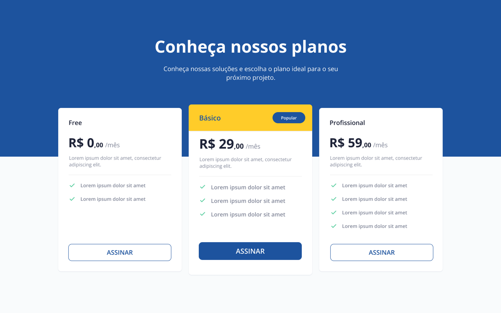

# Price Cards
Este projeto foi proposto na plataforma da **Rocketseat**. Tem como propósito colocar em prática as seguintes tecnologias:

* HTML
* CSS

## :dart: Objetivo do projeto
Construir uma página para mostrar as opções de planos disponíveis para assinatura. Tendo como base o layout abaixo:

## :thumbsup: Resultado final
<h3>Quer ver :eyes: como ficou o resultado final? 
da uma olhada no link da página: :point_down:</h3>
<h3>:smirk::point_right: <a href="https://alvaronascimento04.github.io/price-cards-challenge-rocketseat/" target="_blank">Price Cards</a></h3>